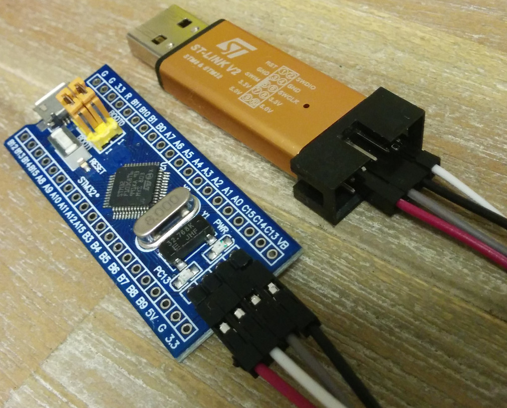

# blue-pill-quickstart

Quickstart a Rust project for the [blue pill board](https://wiki.stm32duino.com/index.php?title=Blue_Pill), or any STM32F103xx board.

## Quickstart a new project

This section suppose your computer is already ready to hack on a blue pill.

Get and cleanup:

```shell
git clone https://github.com/TeXitoi/blue-pill-quickstart.git
mv blue-pill-quickstart my-new-project
cd my-new-project
rm -fr .git LICENSE README.md st-link-v2-blue-pill.jpg
git init
```

Edit `Cargo.toml` for author and project name, and you're ready to go.

## Setting up everything on your machine

First, you need hardware. Buy a [blue pill](https://www.aliexpress.com/w/wholesale-stm32f103c8t6.html?&SortType=total_tranpro_desc) and a [ST-LINK V2](https://www.aliexpress.com/w/wholesale-st-link-v2.html?SortType=total_tranpro_desc). You also need a computer, I will suppose you have a Debian based distribution. It should be easy to adapt the instructions to any supported computer (Linux, MacOSX, Windows).

Then, install everything on your computer:

```shell
curl https://sh.rustup.rs -sSf | sh
rustup install nightly
rustup default nightly
rustup target add thumbv7m-none-eabi
sudo apt-get install gcc-arm-none-eabi gdb-arm-none-eabi openocd
git clone https://github.com/TeXitoi/blue-pill-quickstart.git
cd blue-pill-quickstart
```

Now, connect your ST-LINK to your blue pill. Connect the ST-LINK to your computer.



Launch openocd:

```shell
./openocd.sh
```

Open a new terminal, compile and flash

```shell
cd blue-pill-quickstart
cargo run
```

Now, the program is flashed, and you are on a gdb prompt. Type `c` (for continue) you can see the on board LED blinking.

## Sources

This quickstart is inspired by the [cortex-m-quickstart](https://github.com/japaric/cortex-m-quickstart) and [Discovery](https://japaric.github.io/discovery/). I recommand reading them.
